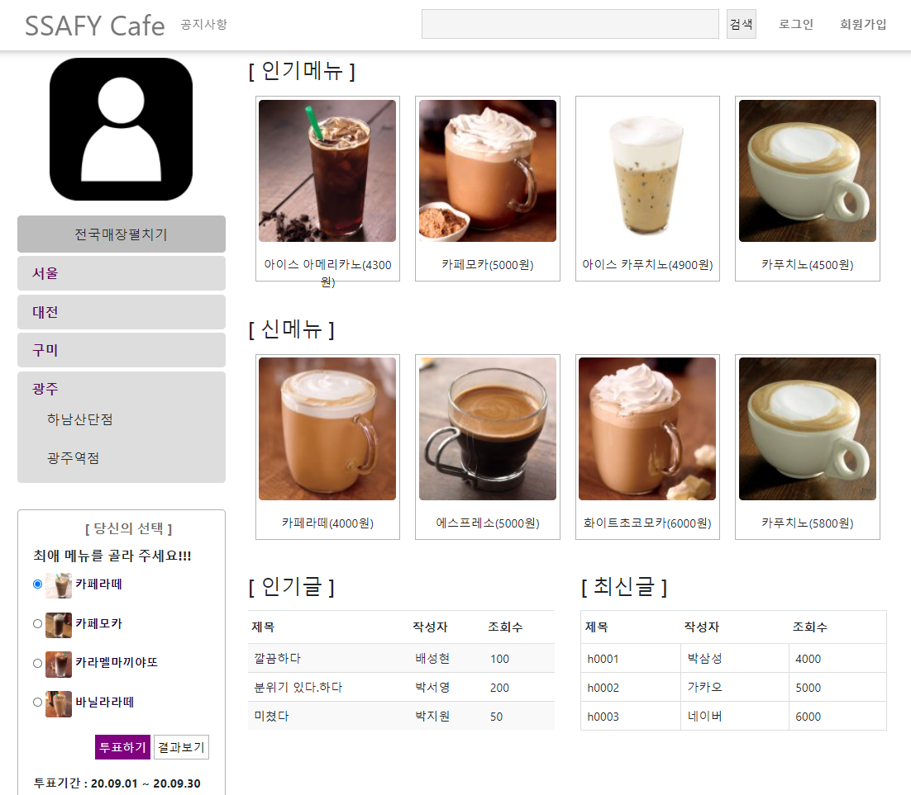

# SSAFY_CAFE
삼성청년소프트웨어4기 SSAFY CAFE 개발작품입니다.

## Funtion

1. Multi Chatting Function
2. Sending Location
3. Making Chatting Room
4. Designate Nickname

## URL
https://skku-club.appspot.com


## ScreenShot
<div>
  
</div>

## npm install 

```nodejs
npm install express
npm install nodejs
npm install bootstrap
```

## package.json

```json
{
  "name": "chat-app",
  "version": "1.0.0",
  "description": "",
  "main": "index.js",
  "scripts": {
    "start": "node server/server.js",
    "test": "mocha server/**/*.test.js",
    "test-watch": "nodemon --exec \"npm test\""
  },
  "engines": {
    "node": "11.2.0"
  },
  "author": "",
  "license": "ISC",
  "dependencies": {
    "bootstrap": "^4.3.1",
    "express": "^4.16.4",
    "moment": "^2.23.0",
    "popper": "^1.0.1",
    "socket.io": "^2.2.0",
    "webkit": "0.0.0"
  },
  "devDependencies": {
    "expect": "^23.6.0",
    "mocha": "^5.2.0"
  }
}
```

