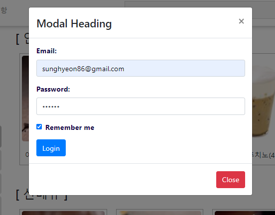

# SSAFY_CAFE
삼성청년소프트웨어4기 SSAFY CAFE 개발작품입니다.

## Server
Tomcat v9.0 Server

## Funtion

1. jQuery를 통한 선호 메뉴 투표, 로그인 및 회원가입 기능 구현
2. Mysql을 통한 카페 음료 종류, 이름, 갯수 관리
3. cafe controller를 통한 메뉴 검색 기능 구현(최소 한 글자 검색)
4. cafe 음료 주문시 count up을 통해 추천메뉴에 등재되게 하는 기능 구현

## URL
localhost

## ScreenShot

   
   
   

